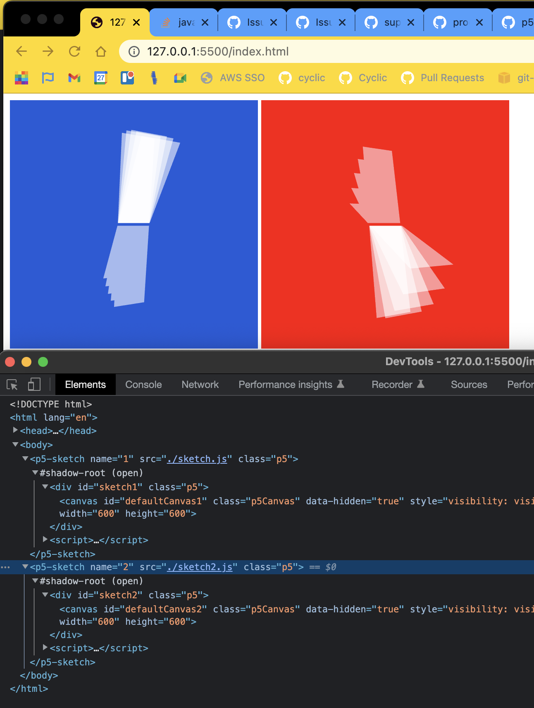

# p5-webcomponent

convert global mode sketch into instance mode and render as custom element / webcomponent


### how to use
require component library
```html
<script src="https://p5.cyclic.app/p5-webcomponent.js"></script>
```

use global mode sketch file as source parameter
```html
<p5-sketch name="1" src="./sketch.js"></p5-sketch>
```

 